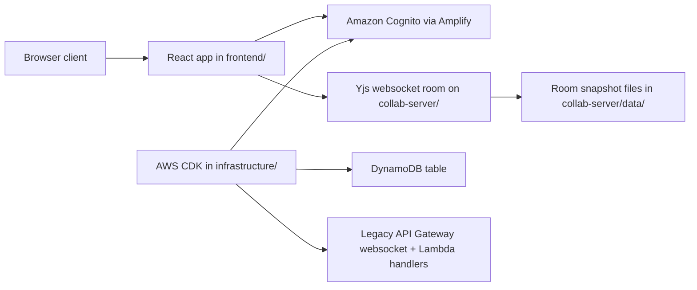
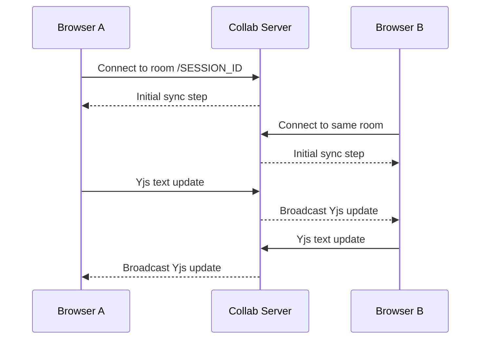

# CodeDuel Technical Report

This document is the detailed project reference for the current CodeDuel codebase. It is written as an internal explainer: what exists, where it lives, why it was chosen, what is active today, and which pieces are still scaffolding or legacy code.

Date of reference: April 8, 2026

## 1. Project summary

CodeDuel is currently an authenticated collaborative coding application built around a shared Monaco editor. Two users can enter the same room and edit the same document in real time. The app uses:

- A React frontend for routing, auth-aware pages, and the editor UI
- A dedicated Yjs websocket server for low-latency collaborative editing
- Amazon Cognito for user accounts and authentication
- AWS CDK infrastructure for Cognito and a legacy websocket backend prototype

The most important architecture decision in the current version is this:

- The live collaborative editor does not use the AWS API Gateway websocket path today
- The live collaborative editor does use the standalone `collab-server/` Yjs websocket service

That distinction matters because the repo still contains an older websocket implementation under `infrastructure/lambda/websocket/`, but that path is not the active editor backend anymore.

## 2. Current product scope vs vision

### What is implemented and working now

- User authentication with Cognito email/password
- Optional Google sign-in through Cognito Hosted UI
- Protected routes for dashboard and session pages
- Session creation and joining through an 8-character room code
- Shared Monaco editor backed by Yjs CRDT synchronization
- Shared language selection across connected clients
- Room persistence through file-based Yjs document snapshots
- Basic connection status feedback in the session UI

### What is present in the repo as vision, marketing, or scaffolding

- Sandboxed code execution
- Video chat
- Problem bank management
- Interview analytics
- Production-grade multiplayer backend beyond the single Yjs websocket node
- Redis, S3, ECS Fargate, and similar platform pieces mentioned in product-facing copy

These broader features are not yet wired into the runtime application shown in the current codebase. Some are reflected in earlier README text and product messaging, but not in active implementation.

## 3. Repository map

```text
codeduel/
├── frontend/
│   ├── src/
│   │   ├── components/
│   │   ├── lib/
│   │   └── pages/
│   ├── public/
│   └── package.json
├── collab-server/
│   ├── server.js
│   ├── data/
│   └── package.json
├── infrastructure/
│   ├── bin/
│   ├── lib/
│   ├── lambda/
│   └── package.json
└── docs/
    └── TECHNICAL_REPORT.md
```

### Role of each top-level folder

| Folder | Purpose | Current status |
|---|---|---|
| `frontend/` | Main user-facing web app | Active |
| `collab-server/` | Real-time collaboration backend for the editor | Active |
| `infrastructure/` | AWS CDK stack and websocket Lambda prototype | Partially active |
| `docs/` | Documentation | Active |

## 4. High-level architecture



### Practical reading of this architecture

- Cognito handles who the user is
- The React app decides which pages require auth
- The editor itself syncs over Yjs websockets
- The Yjs server persists room state to disk
- The AWS websocket stack remains in the repo, but the editor is no longer using it

## 5. Frontend architecture

The frontend is a Vite-based React application written in TypeScript. It lives in `frontend/`.

### 5.1 Entry point and boot flow

Key files:

- `frontend/src/main.tsx`
- `frontend/src/App.tsx`
- `frontend/src/lib/auth.ts`

`main.tsx` loads the app and imports the auth configuration side effect. That auth import matters because it initializes Amplify before the rest of the app needs authentication state.

`App.tsx` defines the route structure:

- `/` -> landing page
- `/login` -> login and sign-up page
- `/dashboard` -> protected dashboard
- `/session/:id` -> protected collaborative editor

Protected pages are wrapped by `ProtectedRoute`, which prevents unauthenticated access.

### 5.2 Authentication subsystem

Key files:

- `frontend/src/lib/auth.ts`
- `frontend/src/lib/useAuth.ts`
- `frontend/src/components/ProtectedRoute.tsx`
- `frontend/src/pages/LoginPage.tsx`

#### `auth.ts`

This file configures Amplify Auth for the frontend.

It supports these frontend environment variables:

| Variable | Purpose |
|---|---|
| `VITE_USER_POOL_ID` | Cognito user pool ID |
| `VITE_USER_POOL_CLIENT_ID` | Cognito app client ID |
| `VITE_COGNITO_DOMAIN` | Hosted UI domain for OAuth providers such as Google |
| `VITE_AUTH_REDIRECT_SIGN_IN` | Sign-in redirect URL list |
| `VITE_AUTH_REDIRECT_SIGN_OUT` | Sign-out redirect URL list |

Important implementation detail:

- The file includes default hardcoded Cognito values
- If local env overrides are not supplied, the app still boots against those defaults

Why this exists:

- It reduces local setup friction
- It allows the project to run immediately without forcing every developer to deploy infrastructure first

Tradeoff:

- Default hardcoded auth targets are convenient for development, but they are less explicit than a purely env-driven configuration

#### `useAuth.ts`

This hook is the frontend auth state bridge.

It does three things:

- Calls `getCurrentUser()` to determine whether a user is signed in
- Tracks loading state so protected routes do not flash incorrect UI
- Subscribes to Amplify `Hub` auth events so redirect-based Google sign-in and normal email sign-in both refresh the current user state

This event handling is especially important for hosted OAuth flows because the browser returns from Cognito and the app needs to rehydrate auth state automatically.

#### `LoginPage.tsx`

This page supports:

- Email/password login
- Email/password sign-up
- Confirmation code flow after sign-up
- Google sign-in button when a Cognito Hosted UI domain is configured

Why this approach was used:

- Cognito handles identity rather than custom auth code
- Email and Google can share the same user pool
- The frontend remains small because Amplify wraps the auth APIs

### 5.3 Page responsibilities

#### `LandingPage.tsx`

Purpose:

- Marketing/entry page
- Routes authenticated users toward the dashboard
- Uses Spline, motion, and branded visual treatment

Notes:

- This page is presentation-heavy
- It reflects product ambition more than strictly current implementation depth

#### `DashboardPage.tsx`

Purpose:

- Authenticated landing page after sign-in
- Lets a user create a new room or join an existing one

How room creation works:

- A session ID is generated client-side with `Math.random().toString(36)`
- It is uppercased and shortened to 8 characters
- The user is navigated to `/session/<ID>`

Why this is simple:

- It removes the need for a server roundtrip to create a room
- It keeps the prototype fast and easy to use

Tradeoff:

- The room ID is a convenience identifier, not a signed or server-issued authorization token

#### `SessionPage.tsx`

Purpose:

- Displays the session header, language selector, connection state, and editor

State managed here:

- `language`
- `connected`

This page does not directly own collaboration logic. Instead, it passes room ID, selected language, and callbacks into `Editor.tsx`.

### 5.4 Collaborative editor subsystem

Key file:

- `frontend/src/components/Editor.tsx`

This file is the heart of the current application.

#### Core technologies used here

- `@monaco-editor/react` for Monaco integration
- `yjs` for CRDT state
- `y-websocket` for real-time transport
- `y-monaco` for binding Yjs text to Monaco

#### What the editor actually synchronizes

The editor creates one `Y.Doc` per session and uses two shared structures:

- `Y.Text("monaco")` for the code contents
- `Y.Map("session")` for session-level metadata

Currently, the `session` map is used for:

- `language`

That is why code edits and language selection are both synced between users.

#### Important behavior in the implementation

1. The Yjs provider is created only after Monaco is fully mounted
2. Connection state is treated as live only when both conditions are true:
- the websocket is connected
- the Yjs document has completed sync
3. The client writes the selected language into shared Yjs state
4. Remote language changes are reflected back into React state
5. Monaco model language is updated whenever the shared language changes

These choices solve several previous collaboration issues:

- editor initialization racing ahead of Monaco mount
- stale "connected" indicators before actual sync
- language dropdown changes being local-only
- more frequent sync drift during reconnects

#### Reliability controls configured in the editor

The `WebsocketProvider` uses:

- shortened reconnect backoff
- periodic resync

The Monaco instance also uses:

- `automaticLayout: true`

That improves resilience during reconnects and keeps layout behavior smoother.

### 5.5 Legacy frontend collaboration hook

Key file:

- `frontend/src/lib/useSession.ts`

This hook is a legacy collaboration implementation that predates the Yjs approach.

What it does:

- Opens a plain websocket
- Sends whole code payloads
- Tracks `remoteCode`
- Debounces outbound sends

Why it is no longer the active path:

- Whole-document broadcasting is more fragile than CRDT syncing
- It is more prone to race conditions and overwrite behavior
- Yjs gives better convergence and conflict handling for collaborative text editing

Recommendation:

- Keep it only if you want a reference during migration
- Otherwise, removing it would reduce confusion

## 6. Collaboration backend architecture

The collaboration backend is the dedicated Yjs server in `collab-server/server.js`.

### Why a dedicated Yjs server exists

The current app originally had websocket-oriented infrastructure under AWS, but the active collaborative editor now needs:

- smoother text synchronization
- less custom merge logic
- better reconnect behavior
- simpler real-time document semantics

Yjs already solves shared text convergence well. Building around its native websocket protocol is much more stable than shipping full-text payloads between clients.

### 6.1 Server responsibilities

The server:

- accepts websocket room connections
- loads or creates a Yjs document for that room
- seeds starter text for brand-new rooms
- relays Yjs sync protocol messages
- relays Yjs awareness messages
- persists document snapshots to disk
- exposes health and readiness endpoints
- removes rooms from memory when the last client leaves

### 6.2 Runtime and transport

Main libraries used:

- `ws`
- `yjs`
- `y-protocols`
- `lib0`

The server runs as a Node HTTP server with an attached `WebSocketServer`.

This design gives two interfaces on the same port:

- HTTP for `/healthz` and `/readyz`
- WebSocket upgrades for room connections

### 6.3 Room model

Each room name is derived from the request path:

- `/ABC12345` -> room name `ABC12345`

For each room, the server creates a `WSSharedDoc`, which extends `Y.Doc`.

Each `WSSharedDoc` holds:

- the CRDT document state
- an awareness instance
- the set of open client connections

### 6.4 Document contents

The collaboration document includes:

- `Y.Text("monaco")` for source code
- any shared metadata written by clients, such as the `session` map and `language`

When a brand-new room is created, the server inserts starter text:

```text
// Start coding here
```

This is controlled by `CODEDUEL_EDITOR_TEMPLATE`.

### 6.5 Persistence model

The server persists rooms as Yjs binary updates in `collab-server/data/`.

Important details:

- Room names are hashed with SHA-256 for file names
- Persistence is debounced
- Writes are atomic via temp file + rename
- A final flush happens on shutdown signals

Why this design works:

- Avoids writing on every keystroke
- Prevents partially written snapshots
- Keeps room persistence simple without introducing a database yet

Tradeoff:

- Persistence is local to one server instance
- Horizontal scaling needs sticky sessions or shared storage/pub-sub

### 6.6 Health and operational features

The server exposes:

- `GET /healthz`
- `GET /readyz`

Both return JSON including:

- host
- port
- room count
- connection count
- whether persistence is enabled

This is useful for:

- local debugging
- container health probes
- quick checks during incident diagnosis

### 6.7 Connection lifecycle controls

The server includes:

- ping/pong heartbeat handling
- max payload enforcement
- disabled websocket compression
- cleanup when clients disconnect

Why these matter:

- ping/pong clears dead sockets
- payload limits reduce risk from unexpectedly large frames
- no per-message deflate lowers CPU overhead and removes one source of latency variability

### 6.8 Collaboration server environment variables

| Variable | Purpose | Default |
|---|---|---|
| `HOST` | Bind address | `0.0.0.0` |
| `PORT` | Server port | `1234` |
| `DISABLE_PERSISTENCE` | Skip disk snapshots | off |
| `YDOCS_DIR` | Snapshot directory | `./data` |
| `PERSISTENCE_FLUSH_DEBOUNCE_MS` | Debounced save interval | `750` |
| `CODEDUEL_EDITOR_TEMPLATE` | Initial room text | `// Start coding here\n` |
| `MAX_PAYLOAD_BYTES` | Websocket frame size cap | `16MB` |
| `GC` | Enable Yjs garbage collection | on |
| `PING_TIMEOUT_MS` | Heartbeat interval | `30000` |

## 7. AWS infrastructure architecture

The AWS infrastructure lives in `infrastructure/` and is defined with CDK.

### 7.1 What is active today

The AWS side is actively relevant for:

- Cognito user authentication
- optional Google identity provider setup

### 7.2 What is present but not currently used by the editor

- DynamoDB-backed websocket connection tracking
- API Gateway websocket routing
- Lambda functions for connect, disconnect, and message fan-out

These are important historically, but they are not the live editor transport in the current app.

### 7.3 `InfrastructureStack`

Key file:

- `infrastructure/lib/infrastructure-stack.ts`

This stack creates:

- a Cognito user pool
- a Cognito app client
- an optional Google identity provider and Cognito Hosted UI domain
- a DynamoDB table
- three Lambda functions for websocket connection lifecycle
- an API Gateway websocket API and stage

### 7.4 Cognito configuration

The stack enables:

- self sign-up
- email sign-in
- auto-verified email
- basic password policy

Why Cognito was chosen:

- avoids building custom auth flows
- provides hosted OAuth compatibility
- integrates cleanly with Amplify on the frontend

### 7.5 Optional Google sign-in

Google auth is enabled only if all three are provided:

- `GOOGLE_CLIENT_ID`
- `GOOGLE_CLIENT_SECRET`
- `COGNITO_DOMAIN_PREFIX`

If only part of the config is supplied, the stack throws an error.

Why this check exists:

- It prevents partial deployments that appear valid but produce broken OAuth flows

When enabled, the stack:

- adds a Google identity provider to Cognito
- creates a Cognito domain
- configures the user pool client for authorization code grant
- requests `openid`, `email`, and `profile` scopes

### 7.6 DynamoDB and legacy websocket backend

The stack creates a table named `codeduel-sessions` with:

- partition key `pk`
- sort key `sk`
- TTL attribute `ttl`
- pay-per-request billing

The legacy websocket Lambda handlers use this table to:

- track active websocket connections per session
- broadcast code payloads to peers
- remove stale connections

This design made sense before the move to Yjs, but it is a less capable fit for collaborative text editing because it relies on broadcasting document payloads instead of CRDT updates.

### 7.7 Infrastructure outputs

The stack outputs:

- `UserPoolId`
- `UserPoolClientId`
- `CognitoDomain` when Google is enabled
- `WebSocketUrl`

The websocket output is currently more useful as a legacy/prototype artifact than as the active editor endpoint.

## 8. End-to-end runtime flows

### 8.1 Email sign-up and sign-in flow

1. User opens `/login`
2. `LoginPage.tsx` calls Amplify auth methods
3. Cognito creates or authenticates the user
4. `useAuth.ts` refreshes user state
5. Protected routes become accessible

### 8.2 Google sign-in flow

1. User clicks the Google button
2. Frontend calls `signInWithRedirect`
3. Browser is sent to Cognito Hosted UI
4. Cognito delegates to Google
5. Browser returns to the configured redirect route
6. Amplify OAuth listener and `Hub` auth events refresh the user in the app

### 8.3 Session creation flow

1. User opens dashboard
2. Dashboard creates an 8-character room code locally
3. App navigates to `/session/:id`
4. `SessionPage.tsx` renders `Editor.tsx`
5. `Editor.tsx` connects to `ws://<collab-server>/<sessionId>`

### 8.4 Collaborative editing flow



Why this is better than full-text broadcasting:

- peers exchange document updates rather than overwriting one another
- both clients converge on the same state even during concurrent edits

### 8.5 Language synchronization flow

1. User changes the dropdown on `SessionPage.tsx`
2. React state updates locally
3. `Editor.tsx` writes the value into `Y.Map("session")`
4. Other clients observe the shared map
5. Remote pages update their `language` state
6. Monaco model language changes on both sides

This is separate from code content synchronization, but it uses the same Yjs document so both state types travel together.

## 9. Dependency catalog

This section explains what is used where and why.

### 9.1 Frontend dependencies in active use

| Package | Where used | Why it exists |
|---|---|---|
| `react`, `react-dom` | Entire frontend | Core UI runtime |
| `react-router-dom` | `App.tsx`, navigation flows | Client-side routing |
| `@monaco-editor/react` | `Editor.tsx` | Embeds Monaco editor in React |
| `yjs` | `Editor.tsx` | CRDT document model |
| `y-websocket` | `Editor.tsx` | Real-time transport for Yjs |
| `y-monaco` | `Editor.tsx` | Connects Monaco model to Yjs text |
| `aws-amplify` | `auth.ts`, `useAuth.ts`, `LoginPage.tsx` | Cognito integration and auth flows |
| `@splinetool/react-spline`, `@splinetool/runtime` | landing, login, dashboard visual scenes | 3D background presentation |
| `framer-motion` | marketing and dashboard animations | Motion and staged entry effects |
| `lucide-react` | various pages | Icons |
| `tailwindcss`, `@tailwindcss/vite`, `tailwind-merge`, `clsx` | styling | Utility-first styling and class composition |

### 9.2 Frontend dependencies present but not clearly active in current code paths

| Package | Current status | Likely purpose |
|---|---|---|
| `@tanstack/react-query` | Installed, not used in current source | Future server-state/data fetching |
| `axios` | Installed, not used in current source | Future API client |
| `zustand` | Installed, not used in current source | Future shared client state |

This likely reflects planned expansion of the app rather than a mistake, but it is useful to know they are not currently participating in runtime behavior.

### 9.3 Collaboration server dependencies

| Package | Where used | Why it exists |
|---|---|---|
| `ws` | `collab-server/server.js` | WebSocket server |
| `yjs` | `collab-server/server.js` | Shared CRDT document state |
| `y-protocols` | `collab-server/server.js` | Yjs sync and awareness protocol encoding |
| `lib0` | `collab-server/server.js` | Binary encoding/decoding helpers used by Yjs protocol |

### 9.4 Infrastructure dependencies

| Package | Where used | Why it exists |
|---|---|---|
| `aws-cdk-lib`, `constructs` | CDK stack | Infrastructure definition |
| `@aws-cdk/aws-apigatewayv2-alpha`, `@aws-cdk/aws-apigatewayv2-integrations-alpha` | CDK stack | WebSocket API resources |
| `@aws-sdk/client-dynamodb` | websocket Lambdas | Connection storage queries |
| `@aws-sdk/client-apigatewaymanagementapi` | websocket Lambdas | Sending websocket messages via API Gateway |

## 10. State and data model

### Frontend state

Current state is mostly local React state:

- auth user/loading state in `useAuth`
- room language and connection state in `SessionPage`
- editor/provider refs inside `Editor`

There is no active centralized frontend application store yet.

### Collaboration state

Live shared state is stored inside Yjs documents:

- source code text
- session metadata such as selected language

### Persistence state

Room persistence currently lives as local Yjs snapshot files on disk:

- one file per room
- file name derived from room name hash

### Identity state

User identity and tokens are managed by Cognito and Amplify rather than manually stored in app code.

### Legacy websocket session state

The old websocket stack stores session connection metadata in DynamoDB for fan-out, but that is not the active collaboration path now.

## 11. Operational notes

### Local development ports

| Service | Default |
|---|---|
| Frontend dev server | `http://localhost:5173` |
| Collab server websocket/health server | `http://localhost:1234` and `ws://localhost:1234` |

### Recommended local startup order

1. Start `collab-server`
2. Start `frontend`
3. Open the app and sign in

### Persisted room files

If persistence is enabled, room documents are written to:

- `collab-server/data/`

These files are implementation artifacts, not source files.

## 12. Known limitations and technical debt

This section is especially important for understanding the current system honestly.

### 12.1 Collaboration server is effectively single-node

The Yjs server persists locally and keeps live room state in process memory.

Implication:

- multiple app instances will need sticky sessions or a shared backend strategy

### 12.2 Websocket room access is not separately authorized

Frontend routes are protected, but the websocket room connection itself uses a room name and URL path without an auth token exchange.

Implication:

- the browser app enforces who can reach the session page
- the collaboration server itself does not independently verify Cognito identity

### 12.3 Room IDs are convenience identifiers, not strong access control

Session IDs are generated on the client and used as room names.

Implication:

- this is fine for a prototype or internal tool
- production hardening should use server-issued session records and room authorization

### 12.4 Presence is supported at protocol level but not exposed in UI

The collaboration server handles Yjs awareness traffic, but the frontend does not currently render:

- remote cursors
- user presence chips
- typing indicators

### 12.5 Old websocket implementation still exists in parallel

This is useful as historical context, but it can confuse future contributors because there are now two collaboration approaches in the repository.

### 12.6 Some dependencies are scaffolded but unused

React Query, Axios, and Zustand are installed but not active in the current runtime.

This is not necessarily wrong, but it is worth documenting so the project reads clearly.

### 12.7 Product messaging is ahead of implementation

The landing page and older README copy describe a larger interview platform vision than the currently wired runtime features.

This is common in early-stage products, but it is important to keep internal and external documentation honest about what exists now.

## 13. Suggested next technical steps

If the goal is to keep growing CodeDuel in a clean direction, the next most valuable steps would be:

1. Add authenticated room authorization at the collaboration server boundary
2. Move room/session creation to a backend-issued record instead of client-generated IDs
3. Decide whether to remove or archive the legacy websocket Lambda path
4. Add presence UI if multi-user awareness is important
5. Introduce a real session domain model if code execution, interview metadata, or analytics are added
6. Add a deployment model for the collab server that supports scaling beyond one instance

## 14. Short conclusion

CodeDuel today is best understood as:

- a polished authenticated React frontend
- a working shared Monaco editor built on Yjs
- a dedicated Node collaboration server with persistence
- Cognito-based authentication with optional Google sign-in
- an AWS infrastructure layer that currently supports auth directly and retains an older websocket design for future cleanup or comparison

That makes the project technically coherent, but still in the stage where the documentation needs to distinguish clearly between:

- what is already real and active
- what is left in the repo from earlier iterations
- what belongs to the broader product roadmap
